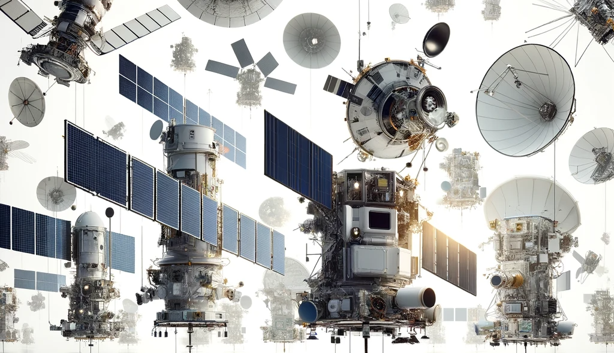

## **Introduction**

This repository contains the design for a gridded ion thruster that meets specific requirements for Space probes and Geo satellites. The designs will focus on the following:

**🚀High efficiency:** Strive for a specific impulse (Isp) of at least 3,000 seconds for Manuevering and Orbital Raising.

**🚀Low propellant consumption:** To be achieved through various design optimizations, such as improving ion extraction efficiency and minimizing grid erosion.

**🚀Long mission lifetime:** This requires careful selection of materials, extensive testing, and robust design principles.

**🚀High thrust-to-weight ratio:**  Crucial aspect for maximizing the payload capacity of the space probe and achieving the desired mission objectives.

**🚀Grid optimization:** Focus on optimizing grid design to minimize ion divergence and maximize thrust generation while minimizing grid erosion.

**🚀Neutralizer performance:** Designs that ensure that the neutralizer effectively compensates for the charge imbalance created by the ion beam to prevent space probe charging.

**🚀Thermal management:**  Design an effective thermal management system to maintain the ion engine within its optimal operating temperature range.

**🚀Reliability:** Design must be highly reliable and resistant to radiation damage, micrometeoroid impacts, and other environmental stresses.

**🚀Compactness and integrability:** The engine should be compact and easy to integrate with the spacecraft's overall structure and power supply as well as for fit in boosting rockets fairing 

**🚀Testability and maintainability:**  This component is essential for ensuring the engine's performance and readiness throughout the mission lifetime.

## **Project Scope**

The project will be completed in several phases. 

**The first phase**will involve the design of the gridded ion thruster itself. This section will discuss the selection of the appropriate ion thruster geometry and the development of a detailed model of the gridded ion thruster. 

**The second phase** will involve the design of the power supply for the gridden ion thruster. This section will discuss the selection of the appropriate power supply architecture and the development of a detailed model of the power supply.

**The third phase** will involve the design of the control system for the gridded ion thruster. This section will discuss the selection of the appropriate control system architecture and the development of a detailed model of the control system.

## 📖**📖Repository Structure**

**docs**

The documentation for the project will be contained in the docs folder. This will include detailed designs of the gridded ion thruster, the power supply, and the control system. It will also include documentation of the thruster testing process and the results of the testing. This section will contain information about the overall design of the thruster, including a discussion of the research that went into the design and the trade-offs made during the design process.

**include**

The include folder will contain the header files that will be used by the C++ files in the python and lib folders. These headers will define the data types and function declarations that will be used by the C++ code.

**python**

The python folder will contain the Python scripts that will be used to control the gridded ion thruster, power supply, and GEO and Lagrange calculations. These scripts will be used to test the ion thruster and the power supply and GEO simulations. The Python scripts will call the C++ libraries to control the thruster and power supply. The Python scripts will also perform the GEO and Lagrange calculations to determine the specific impulse of the ion thruster.

**tests**

The tests folder will contain the tests that will be used to verify the functionality of the gridded ion thruster and the power supply. These tests will include both unit tests and integration tests. The tests will be written in Python and will call the C++ libraries to test the thruster and power supply. The tests will also perform GEO calculations to verify the specific impulse of the ion thruster.

**lib**

The lib folder will contain the C++ libraries that will be used by the Python scripts in the python folder. These libraries will define the data types and function implementations that will be used by the Python code. The lib folder will contain the following libraries:

- A C++ library that will be used to control the ion thruster. This library will be called by the Python scripts to control the ion thruster.
- A C++ library that will be used to control the power supply. This library will be called by the Python scripts to control the power supply.
- A C++ library that will be used to communicate with the control system. This library will be called by the Python scripts to communicate with the control system.

**src**

This folder contains the C++ source code files for the propulsion system, thruster, nozzle, and fuels. 
