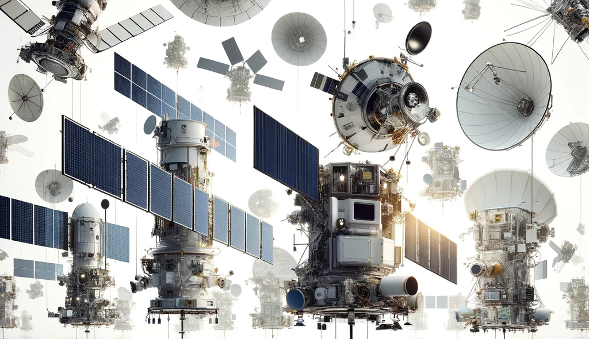

# 🚀 **Ion-Propulsion: Tri-Language Gridded Ion Thruster Suite**

[](https://opensource.org/licenses/MIT)
[](https://github.com/ATaylorAerospace/Ion-Propulsion)
[](https://github.com/ATaylorAerospace/Ion-Propulsion)
[](https://github.com/ATaylorAerospace)
[](https://www.python.org/)
[](https://isocpp.org/)
[](https://www.mathworks.com/products/matlab.html)
[](https://github.com/ATaylorAerospace/Ion-Propulsion)

A flight-grade tri-language (Python, MATLAB, C++) library for gridded ion thruster modeling and mission analysis, developed for space probes and GEO satellites.

**Author: A Taylor**

---

## 🚀 **Introduction**

This repository contains the design and simulation tools for a gridded ion thruster that meets specific requirements for space probes and GEO satellites. The suite provides parity across three languages with verified precision (`1e-6` tolerance).

**🚀 High efficiency:** Strive for a specific impulse (Isp) of at least 3,000 seconds for maneuvering and orbital raising.

**🚀 Low propellant consumption:** Achieved through ion extraction efficiency optimization and minimized grid erosion modeling.

**🚀 Long mission lifetime:** Careful material selection with grid erosion rate tracking and neutralizer performance modeling.

**🚀 High thrust-to-weight ratio:** Crucial for maximizing payload capacity and achieving desired mission objectives.

**🚀 Grid optimization:** Optimized grid design using Child-Langmuir law modeling to minimize ion divergence and maximize thrust generation.

**🚀 Neutralizer performance:** Ensures the neutralizer effectively compensates for charge imbalance created by the ion beam.

**🚀 Thermal management:** Integrated solar cell and thermal property modeling for optimal operating temperature range.

**🚀 Reliability:** Designed for radiation resistance, micrometeoroid impacts, and environmental stresses.

**🚀 Compactness and integrability:** Compact engine design for integration with spacecraft structure, power supply, and launch vehicle fairings.

**🚀 Testability and maintainability:** Comprehensive test suites across all three languages ensure performance and readiness.

---

## 🛠 **Project Scope**

The project delivers three core modules with strict cross-language parity:

**🛠 dynamics:** GEO/Lagrange mission profile calculations and low-thrust trajectory modeling. Includes Hohmann transfer delta-v, Lagrange point estimation, spiral transfer analysis, and low-thrust transfer time computation.

**🛠 propulsion:** High-fidelity Gridded Ion Thruster (GIT) models. Includes ion extraction efficiency, beam voltage/current modeling, Child-Langmuir current limits, grid erosion rates (molybdenum sputtering), neutralizer performance, and power processing unit integration.

**🛠 optimization:** Solvers for maximizing payload fraction (Tsiolkovsky rocket equation), minimizing propellant consumption, extending mission lifetime, and finding optimal Isp for power-constrained missions.

---

## 📖 **Repository Structure**

### 📖 **python/**

Python package using Hatch build system with `astropy.units` for all physical quantities. Install with `pip install -e ./python`. Tests run with `pytest`.

```
python/
  pyproject.toml
  src/ion_propulsion/
    dynamics/mission_profiles.py
    propulsion/thruster.py
    optimization/solvers.py
  tests/
    test_dynamics.py
    test_propulsion.py
    test_optimization.py
```

### 📖 **matlab/**

MATLAB function-based structure with modern `arguments` validation blocks for type safety. Run tests with `runtests('matlab/tests')`.

```
matlab/
  dynamics/
    geo_transfer_delta_v.m
    lagrange_point_l1.m
    low_thrust_transfer_time.m
    spiral_delta_v.m
  propulsion/
    GriddedIonThruster.m
  optimization/
    optimal_payload_fraction.m
    propellant_mass.m
    mission_lifetime.m
    optimize_isp_for_mission.m
  tests/
    test_dynamics.m
    test_propulsion.m
    test_optimization.m
```

### 📖 **cpp/**

Standard CMake project using C++20. Built with Google Test for validation. Build instructions below.

```
cpp/
  CMakeLists.txt
  include/ion_propulsion/
    constants.hpp
    dynamics/mission_profiles.hpp
    propulsion/thruster.hpp
    optimization/solvers.hpp
  src/
    dynamics/mission_profiles.cpp
    propulsion/thruster.cpp
    optimization/solvers.cpp
  tests/
    test_dynamics.cpp
    test_propulsion.cpp
    test_optimization.cpp
```

### 📖 **docs/**

Documentation and reference imagery for the project.

---

## 🏗️ **Build Instructions**

### 🐍 Python

```bash
cd python
pip install -e ".[test]"
pytest tests/
```

### 🧮 MATLAB

```matlab
addpath(genpath('matlab'))
runtests('matlab/tests')
```

### ⚙️ C++

```bash
cd cpp
cmake -B build -DCMAKE_BUILD_TYPE=Release
cmake --build build
cd build && ctest --output-on-failure
```

---

## 🔬 **Core Physics**

All implementations share identical constants and equations:

| Equation | Formula |
|----------|---------|
| **Tsiolkovsky Rocket Equation** | `dv = Isp * g0 * ln(m0 / mf)` |
| **Child-Langmuir Law** | `J_CL = (4/9) * eps0 * sqrt(2e/mi) * V^(3/2) / d^2` |
| **Specific Impulse** | `Isp = (1/g0) * sqrt(2eVb/mi) * eta` |
| **Hohmann Transfer** | `dv1 = v_transfer_peri - v_park` |
| **Spiral Transfer** | `dv = sqrt(mu/ri) - sqrt(mu/rf)` |

### 📊 Physical Constants

| Constant | Value | Unit |
|----------|-------|------|
| `g0` | 9.80665 | m/s^2 |
| `mu_earth` | 3.986004418e14 | m^3/s^2 |
| `R_earth` | 6.371e6 | m |
| `GEO_radius` | 42164.0e3 | m |
| `epsilon_0` | 8.854187817e-12 | F/m |
| `e_charge` | 1.602176634e-19 | C |
| `m_xenon` | 2.18e-25 | kg |

Cross-language precision verified to `1e-6` tolerance.

---

## 🧪 **Test Summary**

| Language | Framework | Tests | Status |
|----------|-----------|-------|--------|
| 🐍 Python | pytest | 36 | ✅ Passing |
| ⚙️ C++ | Google Test | 31 | ✅ Passing |
| 🧮 MATLAB | matlab.unittest | 33 | ✅ Ready |

---

## 📖 **References**

- Goebel, D.M. and Katz, I., *Fundamentals of Electric Propulsion: Ion and Hall Thrusters*
- Vallado, D.A., *Fundamentals of Astrodynamics and Applications*

---

## 📖 **Citation**

If you use this repository in your research, please cite it as:

```bibtex
@misc{ATaylor_IonPropulsion_2025,
  author       = {A. Taylor},
  title        = {Ion Propulsion: Tri-Language Gridded Ion Thruster Suite},
  year         = {2025},
  url          = {https://github.com/ATaylorAerospace/Ion-Propulsion/},
  note         = {Accessed: YYYY-MM-DD}
}
```

---

## 📖 **License**

This project is licensed under the MIT License. See [LICENSE](LICENSE) for details.
