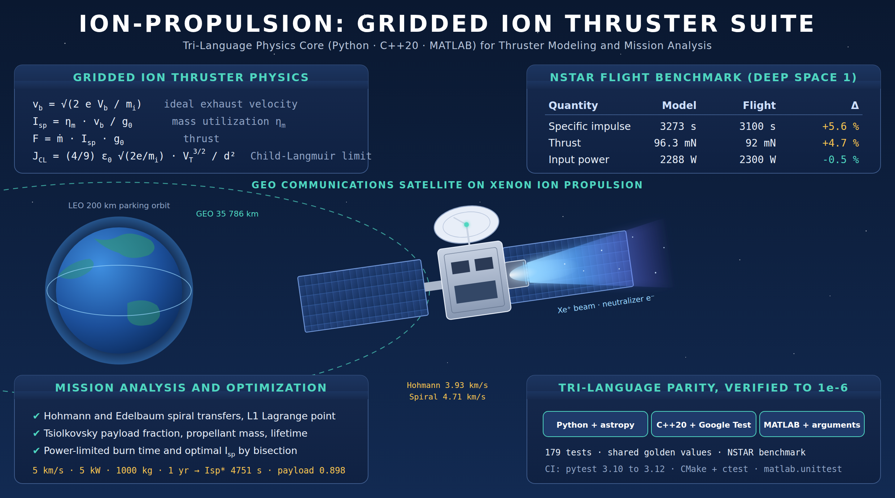

# 🚀 Ion-Propulsion: Gridded Ion Thruster Suite

[](https://github.com/ATaylorAerospace/Ion-Propulsion/actions/workflows/ci.yml)
[](https://www.python.org/)
[](https://isocpp.org/)
[](https://www.mathworks.com/products/matlab.html)
[](https://www.astropy.org/)
[](https://github.com/google/googletest)
[](#-testing)
[](https://opensource.org/licenses/MIT)
[](https://github.com/ATaylorAerospace/Ion-Propulsion)
[](https://ataylor.getform.com/5w8wz)

> **A flight-grade, tri-language (Python, C++, MATLAB) library for gridded ion thruster modeling and electric propulsion mission analysis: one physics core, three implementations, verified to agree to 1e-6**

*Gridded ion thruster physics · Child-Langmuir extraction limits · Grid erosion and neutralizer budgets · Hohmann and low-thrust spiral transfers · Power-constrained Isp optimization · NSTAR flight benchmark*

**Author: A Taylor**

---

## 💡 The Problem

Gridded ion thrusters power the longest-lived spacecraft in the solar system: Deep Space 1, Dawn, and every all-electric GEO communications satellite raised from GTO on xenon alone. Designing one, or sizing a mission around one, means answering coupled questions that live in different toolchains:

- **⚡ How much thrust and Isp does a given beam voltage, beam current, and propellant flow actually produce?** Ideal exhaust velocity is easy; the mass utilization and discharge losses that separate a textbook number from a flight number are not.
- **🕳️ How much current can the grids extract before space charge chokes the beam?** The Child-Langmuir limit sets the aperture, gap, and voltage trade for every grid design.
- **⏳ How long will the grids and neutralizer last?** Sputter erosion and keeper power are the life-limiting budgets on a multi-year mission.
- **🛰️ What Isp should the mission fly at?** Higher Isp saves propellant but, at fixed power, lengthens the burn. The optimum depends on the delta-v, the power available, and how long the mission can afford to thrust.

Mission analysts reach for MATLAB, flight software is C++, and research scripts are Python. Keeping three copies of the same physics consistent by hand is where errors creep in.

---

## ✨ The Solution

One set of equations from Goebel and Katz and Vallado, implemented three times with identical constants and identical algorithms, and pinned to each other by golden-value tests that must agree to **1e-6 relative tolerance** in every language:

| Layer | What It Does | Python | C++20 | MATLAB |
|-------|-------------|:------:|:-----:|:------:|
| 🔬 **propulsion** | `GriddedIonThruster`: exhaust velocity, Isp, thrust, beam and total power, mass utilization, electrical efficiency, Child-Langmuir current density, grid erosion rate, neutralizer power | ✅ | ✅ | ✅ |
| 🛰️ **dynamics** | Hohmann transfer to GEO, L1 Lagrange point, low-thrust transfer time, Edelbaum spiral delta-v | ✅ | ✅ | ✅ |
| 🎯 **optimization** | Tsiolkovsky payload fraction, propellant mass, mission lifetime, power-limited burn time, optimal Isp under a power budget and a burn-time budget | ✅ | ✅ | ✅ |
| 📏 **Units and validation** | `astropy.units` on every Python quantity; `std::invalid_argument` in C++; `arguments` blocks in MATLAB | ✅ | ✅ | ✅ |
| 🧪 **Tests** | pytest / Google Test / `matlab.unittest`, NSTAR flight benchmark, shared golden values | ✅ | ✅ | ✅ |
| 🔁 **CI** | GitHub Actions: pytest on Python 3.10 to 3.12, CMake + ctest, MATLAB test runner | ✅ | ✅ | ✅ |

### 🚀 Design goals

**🚀 High efficiency:** Specific impulse (Isp) of at least 3,000 seconds for maneuvering and orbital raising.

**🚀 Low propellant consumption:** Ion extraction efficiency modeling and a power-aware Isp optimizer that trades propellant against burn time.

**🚀 Long mission lifetime:** Grid erosion rate and neutralizer keeper power tracked as first-class budgets.

**🚀 High thrust-to-weight ratio:** Thrust, Isp, and input power evaluated together at every operating point.

**🚀 Grid optimization:** Child-Langmuir space-charge limit for aperture, gap, and voltage trades.

**🚀 Neutralizer performance:** Keeper voltage and current modeled to size the charge-balance budget.

**🚀 Reliability:** Every constructor and function validates its inputs in all three languages.

**🚀 Compactness and integrability:** No runtime dependencies beyond NumPy and astropy in Python, none at all in C++, and plain functions in MATLAB.

**🚀 Testability and maintainability:** 179 tests across the three suites, all pinned to the same golden values.

---

## 🏗️ Architecture

```
                         ┌──────────────────────────────────────────┐
                         │          Shared physics core             │
                         │   Goebel & Katz (thruster)               │
                         │   Vallado (astrodynamics)                │
                         │   identical constants and algorithms     │
                         └──────────────────────────────────────────┘
                                             │
              ┌──────────────────────────────┼──────────────────────────────┐
              ▼                              ▼                              ▼
   ┌──────────────────────┐      ┌──────────────────────┐      ┌──────────────────────┐
   │       python/        │      │         cpp/         │      │        matlab/       │
   │  ion_propulsion pkg  │      │  ion_propulsion lib  │      │   function toolbox   │
   │  astropy.units       │      │  C++20, header API   │      │   arguments blocks   │
   └──────────────────────┘      └──────────────────────┘      └──────────────────────┘
              │                              │                              │
    ┌─────────┼─────────┐          ┌─────────┼─────────┐          ┌─────────┼─────────┐
    ▼         ▼         ▼          ▼         ▼         ▼          ▼         ▼         ▼
 dynamics propulsion optimiz.   dynamics propulsion optimiz.   dynamics propulsion optimiz.
              │                              │                              │
              ▼                              ▼                              ▼
        pytest (78)               Google Test (50)             matlab.unittest (51)
              └──────────────── same golden values, 1e-6 ────────────────┘
```

Each language exposes the same three modules with the same function names, argument order, defaults, and error behaviour. The optimizer uses bisection rather than a library minimizer so that all three implementations converge to the same number, not merely to the same neighbourhood.

---

## 🔬 Physics

### Gridded ion thruster (Goebel and Katz, chapter 2)

| Quantity | Relation | Notes |
|----------|----------|-------|
| Exhaust velocity | $v_b = \sqrt{2 e V_b / m_i}$ | singly charged xenon |
| Mass utilization | $\eta_m = I_b\, m_i / (e\, \dot m)$ | fraction of propellant ionised |
| Electrical efficiency | $\eta_e = P_b / (P_b + I_b\, \varepsilon_d)$ | $\varepsilon_d$ = discharge loss, W/A |
| Specific impulse | $I_{sp} = \eta_m\, v_b / g_0$ | eq. 2.4-8, unit divergence |
| Thrust | $F = \dot m\, I_{sp}\, g_0 = \eta_m\, \dot m\, v_b$ | |
| Child-Langmuir limit | $J_{CL} = \tfrac{4}{9}\, \varepsilon_0 \sqrt{2e/m_i}\; V_T^{3/2} / d^2$ | $V_T = V_s + \lvert V_a \rvert$ |
| Grid erosion | $\dot m_{erode} = Y\, I_b\, m_{Mo} / e$ | sputter yield $Y$, molybdenum grids |
| Neutralizer power | $P_n = V_k\, I_k$ | keeper voltage and current |

### Mission analysis (Vallado, chapter 6; Goebel and Katz, section 2.3)

| Quantity | Relation |
|----------|----------|
| Hohmann transfer | $\Delta v_1 = v_{t,p} - v_{park}$, $\Delta v_2 = v_{GEO} - v_{t,a}$ from vis-viva |
| Edelbaum spiral | $\Delta v = \sqrt{\mu / r_i} - \sqrt{\mu / r_f}$ |
| L1 Lagrange point | $r_{L1} = R\, (m_2 / 3 m_1)^{1/3}$ |
| Payload fraction | $f = \exp(-\Delta v / I_{sp} g_0)$ |
| Power-limited burn time | $t_b = m_0 (1 - e^{-\Delta v / v_e})\, v_e^2 / (2 \eta P)$ |
| Optimal Isp | $\max \{ I_{sp} : t_b(I_{sp}) \le t_{max} \}$ over $[500, 20000]$ s |

### 📊 Physical constants

| Constant | Value | Unit |
|----------|-------|------|
| `g0` | 9.80665 | m/s² |
| `mu_earth` | 3.986004418e14 | m³/s² |
| `R_earth` | 6.371e6 | m |
| `GEO_radius` | 42164.0e3 | m |
| `epsilon_0` | 8.854187817e-12 | F/m |
| `e_charge` | 1.602176634e-19 | C |
| `m_xenon` | 2.18e-25 | kg |
| `m_molybdenum` | 1.594e-25 | kg |
| `seconds_per_julian_year` | 31557600 | s |

### 🛰️ NSTAR flight benchmark

The model is checked in every language against the NSTAR engine that flew on Deep Space 1 at full power (1100 V beam, 1.76 A, 3.0 mg/s xenon):

| Quantity | Model | Flight | Difference |
|----------|------:|-------:|-----------:|
| Specific impulse | 3273 s | 3100 s | +5.6 % |
| Thrust | 96.3 mN | 92 mN | +4.7 % |
| Input power | 2288 W | 2300 W | -0.5 % |

The residual is the beam divergence and doubly charged ion correction ($\gamma \approx 0.95$) that the model intentionally leaves out; the test suites assert agreement within 10 %.

---

## 🚀 Quick Start

```bash
# Clone
git clone https://github.com/ATaylorAerospace/Ion-Propulsion.git
cd Ion-Propulsion

# Python: install with test extras and run the suite
pip install -e "./python[test]"
pytest python/tests -v

# C++: configure, build, and test (Google Test is fetched automatically if not installed)
cmake -S cpp -B cpp/build -DCMAKE_BUILD_TYPE=Release
cmake --build cpp/build --parallel
ctest --test-dir cpp/build --output-on-failure
```

```matlab
% MATLAB: add the toolbox to the path and run the suite
addpath(genpath('matlab'))
results = runtests('matlab/tests');
table(results)
```

---

## 🔮 Usage Examples

### 1. Thruster performance (Python)

```python
from ion_propulsion.propulsion import GriddedIonThruster

# NSTAR at full power
t = GriddedIonThruster(
    beam_voltage_V=1100.0,
    beam_current_A=1.76,
    screen_grid_voltage_V=1100.0,
    accel_grid_voltage_V=-180.0,
    mass_flow_rate_kgs=3.0e-6,
)

print(t.specific_impulse_s)          # 3273.07 s
print(t.thrust_N.to("mN"))           # 96.29 mN
print(t.total_power_W)               # 2288.0 W
print(t.mass_utilization)            # 0.798
print(t.child_langmuir_current_A)    # 218.49 A / m2
print(t.grid_erosion_rate_kgs())     # 1.75e-07 kg / s
```

### 2. GEO transfer budget (Python)

```python
from ion_propulsion.dynamics import geo_transfer_delta_v, spiral_delta_v
from ion_propulsion.optimization import propellant_mass_kg

dv1, dv2 = geo_transfer_delta_v(200.0)        # 200 km parking orbit altitude
print(dv1, dv2)                               # 2.457 km / s, 1.478 km / s

dv_spiral = spiral_delta_v(6.571e6, 42164.0e3)
print(dv_spiral)                              # 4713.8 m / s (continuous low thrust)

m_prop = propellant_mass_kg(1000.0, 3273.0, dv_spiral.value)
print(m_prop)                                 # 136.6 kg of xenon for a 1000 kg spacecraft
```

### 3. Optimal Isp under a power and time budget (Python)

```python
from ion_propulsion.optimization import optimize_isp_for_mission, power_limited_burn_time_s

# 5 km/s mission, 5 kW to the thruster, 1000 kg spacecraft, 70 % efficiency, one year to burn
isp, payload_fraction = optimize_isp_for_mission(5000.0, 5000.0, 1000.0, eta=0.7)
print(isp, payload_fraction)                  # 4751.2 s, 0.898

# Double the power and the optimum climbs
isp10, pf10 = optimize_isp_for_mission(5000.0, 10000.0, 1000.0, eta=0.7)
print(isp10, pf10)                            # 9260.7 s, 0.946

print(power_limited_burn_time_s(isp.value, 5000.0, 5000.0, 1000.0, 0.7) / 86400)  # 365.25 days
```

### 4. The same thruster in C++

```cpp
#include "ion_propulsion/propulsion/thruster.hpp"
#include "ion_propulsion/optimization/solvers.hpp"
#include <iostream>

int main() {
    using namespace ion_propulsion;

    const propulsion::GriddedIonThruster t(1100.0, 1.76, 1100.0, -180.0, 3.0e-6);
    std::cout << "Isp    = " << t.specific_impulse() << " s\n";     // 3273.07
    std::cout << "Thrust = " << t.thrust() * 1e3 << " mN\n";        // 96.29

    const auto r = optimization::optimize_isp_for_mission(5000.0, 5000.0, 1000.0, 0.7);
    std::cout << "Optimal Isp = " << r.optimal_Isp << " s, payload fraction = "
              << r.max_payload_fraction << '\n';                    // 4751.22 s, 0.898
}
```

### 5. The same thruster in MATLAB

```matlab
t = GriddedIonThruster(1100, 1.76, 1100, -180, 3.0e-6);
fprintf('Isp = %.2f s, thrust = %.2f mN\n', t.specific_impulse(), 1e3 * t.thrust());
% Isp = 3273.07 s, thrust = 96.29 mN

[Isp_opt, frac] = optimize_isp_for_mission(5000, 5000, 1000, 0.7);
fprintf('Optimal Isp = %.2f s, payload fraction = %.3f\n', Isp_opt, frac);
% Optimal Isp = 4751.22 s, payload fraction = 0.898
```

---

## 📁 Repository Structure

```
Ion-Propulsion/
├── .github/
│   └── workflows/
│       └── ci.yml                        # GitHub Actions: pytest 3.10 to 3.12, CMake + ctest, MATLAB
├── docs/
│   └── geosats.png                       # Hero banner image
├── python/
│   ├── pyproject.toml                    # Hatch build, numpy + astropy runtime deps
│   ├── README.md                         # Package README shipped in the wheel
│   ├── src/ion_propulsion/
│   │   ├── __init__.py                   # Package version and module exports
│   │   ├── dynamics/mission_profiles.py  # Hohmann, L1, low-thrust time, spiral
│   │   ├── propulsion/thruster.py        # GriddedIonThruster
│   │   └── optimization/solvers.py       # Tsiolkovsky, burn time, Isp optimizer
│   └── tests/
│       ├── test_dynamics.py              # 18 tests
│       ├── test_propulsion.py            # 31 tests, NSTAR benchmark, golden values
│       └── test_optimization.py          # 29 tests
├── cpp/
│   ├── CMakeLists.txt                    # C++20 library + Google Test (system or fetched)
│   ├── include/ion_propulsion/
│   │   ├── constants.hpp                 # Shared physical constants
│   │   ├── dynamics/mission_profiles.hpp
│   │   ├── propulsion/thruster.hpp
│   │   └── optimization/solvers.hpp
│   ├── src/
│   │   ├── dynamics/mission_profiles.cpp
│   │   ├── propulsion/thruster.cpp
│   │   └── optimization/solvers.cpp
│   └── tests/
│       ├── test_dynamics.cpp             # 10 tests
│       ├── test_propulsion.cpp           # 19 tests, NSTAR benchmark, golden values
│       └── test_optimization.cpp         # 21 tests
├── matlab/
│   ├── dynamics/
│   │   ├── geo_transfer_delta_v.m
│   │   ├── lagrange_point_l1.m
│   │   ├── low_thrust_transfer_time.m
│   │   └── spiral_delta_v.m
│   ├── propulsion/
│   │   └── GriddedIonThruster.m
│   ├── optimization/
│   │   ├── optimal_payload_fraction.m
│   │   ├── propellant_mass.m
│   │   ├── mission_lifetime.m
│   │   ├── power_limited_burn_time.m
│   │   └── optimize_isp_for_mission.m
│   └── tests/
│       ├── test_dynamics.m               # 10 tests
│       ├── test_propulsion.m             # 20 tests, NSTAR benchmark, golden values
│       └── test_optimization.m           # 21 tests
├── .gitignore
├── LICENSE                               # MIT
└── README.md
```

---

## 🧩 Components

### 🔬 Propulsion (`GriddedIonThruster`)
Constructed from beam voltage, beam current, screen and accelerator grid voltages, propellant mass flow rate, and optional ion mass, grid gap, aperture radius, and discharge loss. Exposes exhaust velocity, specific impulse, thrust, beam and total power, mass utilization, electrical efficiency, combined extraction efficiency, Child-Langmuir current density, grid erosion rate, and neutralizer keeper power. The accelerator grid may be given with either sign; its magnitude is used.

### 🛰️ Dynamics
`geo_transfer_delta_v` takes a parking orbit **altitude** in km and returns both Hohmann burns in km/s. `spiral_delta_v` gives the continuous low-thrust equivalent between two radii in metres. `lagrange_point_l1` and `low_thrust_transfer_time` round out the mission profile toolkit.

### 🎯 Optimization
`optimal_payload_fraction`, `propellant_mass`, and `mission_lifetime` are the Tsiolkovsky budget functions. `power_limited_burn_time` converts a power budget into the time needed to deliver a delta-v at a given Isp. `optimize_isp_for_mission` finds the highest Isp whose burn time fits a mission-duration budget (default one Julian year) by bisection over 500 to 20000 s, and raises an error when even 500 s cannot meet the budget.

---

## 🔧 API Conventions

**🔧 Altitude versus radius:** `geo_transfer_delta_v(r_park_km)` takes the parking orbit altitude above Earth's surface in km. `spiral_delta_v` takes orbital radii in metres.

**🔧 Accelerator grid sign:** `child_langmuir_current` uses $V_T = V_{screen} + \lvert V_{accel} \rvert$ and raises an error if the total is not positive. Python's `child_langmuir_current_A` keeps its historical name but returns a current density in A/m².

**🔧 Input validation:** Python raises `ValueError`, C++ throws `std::invalid_argument`, and MATLAB uses `arguments` blocks with `mustBePositive` and friends. Zero delta-v is accepted by the Tsiolkovsky functions in all three languages; the optimizer requires a positive delta-v.

**🔧 Optimizer defaults:** `eta = 0.7` and `max_burn_time = 31557600 s` in all three languages. Python and C++ take them as optional arguments; MATLAB as optional positional arguments.

**🔧 Units:** Python returns `astropy.units.Quantity` objects. C++ and MATLAB use SI throughout (seconds, newtons, watts, kg/s, A/m²) except for `geo_transfer_delta_v`, which returns km/s.

---

## 🧪 Testing

Every suite checks the same golden values to 1e-6 relative tolerance, so a change in any language that breaks parity fails in that language's own tests.

| Language | Framework | Tests | Runs in CI |
|----------|-----------|:-----:|:----------:|
| 🐍 Python 3.10, 3.11, 3.12 | pytest | 78 | ✅ |
| ⚙️ C++20 | Google Test 1.14 | 50 | ✅ |
| 🧮 MATLAB R2023b | matlab.unittest | 51 | ✅ (advisory) |

```bash
# Python
pytest python/tests -v

# C++
ctest --test-dir cpp/build --output-on-failure

# MATLAB
matlab -batch "addpath(genpath('matlab')); assertSuccess(runtests('matlab/tests'))"
```

The MATLAB job depends on MathWorks-hosted licensing for public repositories and is marked advisory so that a licensing outage cannot block a pull request; its results remain visible in the workflow log.

---

## 🤝 Contributing

**🤝 Cross-language parity:** Any physics function added or changed in one language must be mirrored in the other two with identical constants, formulas, defaults, and error behaviour. Add the new golden value to all three suites.

**🤝 Input validation:** Every constructor and function that accepts a physical parameter validates it. Follow the existing pattern in each language.

**🤝 Unit safety:** Python returns `astropy.units.Quantity`. C++ and MATLAB document units in Doxygen and help blocks.

**🤝 Build artifacts:** `.gitignore` covers Python, C++, MATLAB, and IDE artifacts. Do not commit generated files.

**🤝 Tests:** Every new function needs tests in all three languages. Run the full suite before opening a pull request; CI runs it again on every push and PR.

---

## 📋 Changelog

### v1.2.0

**🔴 Physics corrections**

- **Specific impulse (all languages):** Isp was multiplied by the electrical efficiency, which per Goebel and Katz affects input power rather than exhaust velocity. Now $I_{sp} = \eta_m v_b / g_0$. With NSTAR inputs the model moves from 10 % below flight Isp to 5.6 % above, the expected residual for the unmodelled divergence factor.
- **Isp optimizer (all languages):** The power and efficiency inputs cancelled out of the objective, so the optimizer always returned the search upper bound, and MATLAB ignored the inputs entirely. Replaced with a power-limited burn-time constraint solved by bisection; the optimum now depends on power, efficiency, and a new `max_burn_time` argument (default one Julian year). Search window unified to 500 to 20000 s.

**🟡 Parity fixes**

- **Child-Langmuir (Python, C++):** Use $\lvert V_{accel} \rvert$ as documented; MATLAB already did. All three now reject a non-positive total voltage.
- **MATLAB defaults:** `grid_erosion_rate`, `neutralizer_power`, and the optimizer's `eta` gained the defaults that Python and C++ already had.
- **Zero delta-v:** MATLAB `optimal_payload_fraction` and `propellant_mass` now accept zero delta-v like the other languages.
- **New `power_limited_burn_time`** in all three languages; new `exhaust_velocity` accessor on the thruster.

**🟡 Test suites**

- MATLAB tests asserted a 4.93 km/s GEO transfer (true value 3.93 km/s) and an Isp of at least 3000 s from a fixture that produced 2300 s; both corrected.
- NSTAR flight benchmark and shared golden values (1e-6) added to all three suites; suite sizes are now 78 / 50 / 51.

**🟢 Build and housekeeping**

- **CMake:** Google Test is taken from the system if present, otherwise fetched over git (the zip download was blocked behind some proxies). Added `ION_PROPULSION_BUILD_TESTS`, warnings, and a namespaced alias target.
- **GitHub Actions CI** for Python 3.10 to 3.12, C++, and MATLAB.
- Python LaTeX docstrings rendered doubled backslashes; fixed. `scipy` dependency removed. Versions aligned to 1.2.0 in `pyproject.toml` and `CMakeLists.txt`.

### v1.1.0

- Wired `power_W` and `eta` into the Python optimizer objective (superseded in v1.2.0).
- MATLAB `child_langmuir_current` corrected to use the screen and accelerator voltages.
- MATLAB `geo_transfer_delta_v` aligned to the altitude convention.
- Python `GriddedIonThruster` constructor validation; repository `.gitignore`.

---

## 📖 References

- Goebel, D. M. and Katz, I., *Fundamentals of Electric Propulsion: Ion and Hall Thrusters*, JPL Space Science and Technology Series, Wiley, 2008.
- Vallado, D. A., *Fundamentals of Astrodynamics and Applications*, 4th ed., Microcosm Press, 2013.
- Brophy, J. R. et al., "Ion Propulsion System (NSTAR) DS1 Technology Validation Report," JPL, 2000 (NSTAR benchmark values).

---

## 📖 Citation

If you use this repository in your research, please cite it as:

```bibtex
@misc{ATaylor_IonPropulsion_2026,
  author       = {A. Taylor},
  title        = {Ion Propulsion: Tri-Language Gridded Ion Thruster Suite},
  year         = {2026},
  url          = {https://github.com/ATaylorAerospace/Ion-Propulsion/},
  note         = {Accessed: YYYY-MM-DD}
}
```

---

## 📜 License

This project is licensed under the [MIT License](LICENSE).

Copyright (c) 2026 A Taylor

---

## 📬 Contact

Have questions, ideas, or want to collaborate? Reach out directly:

[](https://ataylor.getform.com/5w8wz)
